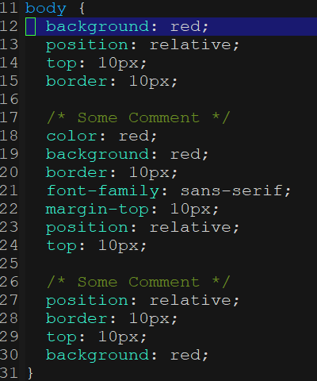
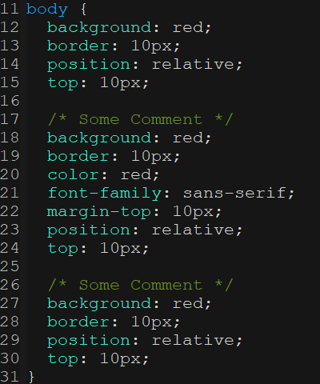

[](https://www.gnu.org/licenses/gpl-3.0)
[](https://melpa.org/#/com-css-sort)
[](https://stable.melpa.org/#/com-css-sort)

# com-css-sort
> Common way of sorting the CSS attributes.

[](https://github.com/jcs-elpa/com-css-sort/actions/workflows/test.yml)

| Before Sotring                                  |  Type Sorting                                      |  Alphabetic Sorting                                      |
|:-----------------------------------------------:|:--------------------------------------------------:|:--------------------------------------------------------:|
||||

## How to use?

### Alphabetic Order

1. Just set `com-css-sort-sort-type` to alphabetic-sort.

```el
(setq com-css-sort-sort-type 'alphabetic-sort)
```

### Type Order / Customize Order Your Own

1. Set `com-css-sort-sort-type` to type-sort.

```el
(setq com-css-sort-sort-type 'type-sort)
```

2. Create `sort-order.config` file at the version control root directory.
You can grab a config file from `./config_examples/` directory in this 
repository. If the file does not exists, variable list 
`com-css-sort-default-attributes-order`  will be use as default sorting
order list.

3. Look at the .config file, the order in the file will be the order that
the CSS attributes will be sorted.

## Configuration

Type of sorting algorithm you want used when sorting CSS attributes.

* type-sort : Sort in group type. Use 'sort-order.config' if there is one in the 
version control root directory. (Default)

* alphabetic-sort : Sort in alphabetic order. The 'sort-order.config' file will be 
ignore and will not do anything.

```el
(setq com-css-sort-sort-type 'type-sort)        ; Type Sorting
(setq com-css-sort-sort-type 'alphabetic-sort)  ; Alphabetic Sorting
```

If you don't like the path or file name, you can change it too. This variable is
relative path to version control root directory.

```el
(setq com-css-sort-sort-file "sort-order.config")
```

Customize your own sorting order programmatically. If you do not have the
`sort-order.config' file in the version control root directory then this will be use!

```el
;; Default sorting order list.
(setq com-css-sort-default-attributes-order '("display" "position" "top" "right" "bottom" "left" "float" "clear"
                                              "visibility" "opacity" "z-index" "margin" "margin-top" 
                                              "margin-right" "margin-bottom" "margin-left" "outline" "border" 
                                              "border-top" "border-right" "border-bottom" "border-left" 
                                              "border-width" "border-top-width" "border-right-width" 
                                              "border-bottom-width" "border-left-width" "border-style" 
                                              "border-top-style" "border-right-style" "border-bottom-style" 
                                              "border-left-style" "border-color" "border-top-color" 
                                              "border-right-color" "border-bottom-color" "border-left-color" 
                                              "background" "background-color" "background-image" 
                                              "background-repeat" "background-position" "cursor" "padding" 
                                              "padding-top" "padding-right" "padding-bottom" "padding-left" 
                                              "width" "min-width" "max-width" "height" "min-height" "max-height" 
                                              "overflow" "list-style" "caption-side" "table-layout" 
                                              "border-collapse" "border-spacing" "empty-cells" "vertical-align" 
                                              "text-align" "text-indent" "text-transform" "text-decoration" 
                                              "line-height" "word-spacing" "letter-spacing" "white-space" "color" 
                                              "font" "font-family" "font-size" "font-weight" "content" "quotes"))
```

## Key Bindings

Just bind the key if to whatever you feel comfortable with.

```el
;; Sort attributes inside block.
(define-key css-mode-map (kbd "C-k s") #'com-css-sort-attributes-block)

;; Sort attributes through the whole document.
(define-key css-mode-map (kbd "C-k d") #'com-css-sort-attributes-document)
```

## Contribute

[](http://makeapullrequest.com)
[](https://github.com/bbatsov/emacs-lisp-style-guide)
[](https://www.paypal.me/jcs090218)

If you would like to contribute to this project, you may either 
clone and make pull requests to this repository. Or you can 
clone the project and establish your own branch of this tool. 
Any methods are welcome!
