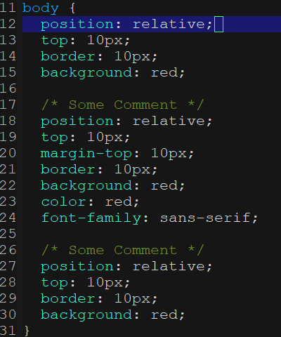

# com-css-sort #

com-css-sort stands for Common CSS Sorting. The goal of this project
is to provide a basic way of sorting CSS attributes.<br/><br/>


## How to use? ##

### Alphabetic Order ###
1. Just set `com-css-sort-sort-type` to 1.

### Customize Order Your Own ###
1. Create `sort-order.ccs` file at the version control root directory.
You can grab a ccs file from `./ccs_examples/` directory in this repository.
2. Look at the .ccs file, the order in the file will be the order that
the CSS attributes will be sorted.


## Configuration ##
Type of sorting algorithm you want used when sorting CSS attributes.<br/>
* 0 : Sort in group type. Use 'sort-order.ccs' if
there is one in the version control root directory. (Default)<br/>
* 1 : Sort in alphabetic order. The 'sort-order.ccs'
file will be ignore and will not do anything.<br/>
```
(setq com-css-sort-sort-type 0)
```

If you don't like the path or file name, you can change it too. This variable is
relative path to version control root directory.
```
(setq com-css-sort-sort-file "sort-order.ccs")
```

Customize your own sorting order programmatically. If you do not have the
`sort-order.ccs' file in the version control root directory then this will be use!
```
(setq com-css-sort-default-attributes-order '("display" "position" "top" "right" "bottom" "left" "float" "clear"
"visibility" "opacity" "z-index" "margin" "margin-top" "margin-right" "margin-bottom" "margin-left" "outline"
"border" "border-top" "border-right" "border-bottom" "border-left" "border-width" "border-top-width"
"border-right-width" "border-bottom-width" "border-left-width" "border-style" "border-top-style"
"border-right-style" "border-bottom-style" "border-left-style" "border-color" "border-top-color"
"border-right-color" "border-bottom-color" "border-left-color" "background" "background-color" "background-image"
"background-repeat" "background-position" "cursor" "padding" "padding-top" "padding-right" "padding-bottom"
"padding-left" "width" "min-width" "max-width" "height" "min-height" "max-height" "overflow" "list-style"
"caption-side" "table-layout" "border-collapse" "border-spacing" "empty-cells" "vertical-align" "text-align"
"text-indent" "text-transform" "text-decoration" "line-height" "word-spacing" "letter-spacing" "white-space"
"color" "font" "font-family" "font-size" "font-weight" "content" "quotes"))
```


## Key Bindings ##
Just bind the key if to whatever you feel comfortable with.
```
;; Sort attributes inside block.
(define-key css-mode-map (kbd "C-k s") #'com-css-sort-attributes-block)

;; Sort attributes through the whole document.
(define-key css-mode-map (kbd "C-k d") #'com-css-sort-attributes-document)
```

## Screen Shot ##
Before Sotring <br/>


Type Sorting <br/>


Alphabetic Sorting <br/>


## Contribution ##
If you would like to contribute to this project. You may either
clone and make pull request to this repository. Or you can
clone the project and make your own branch of this tool. Any
methods are welcome!
